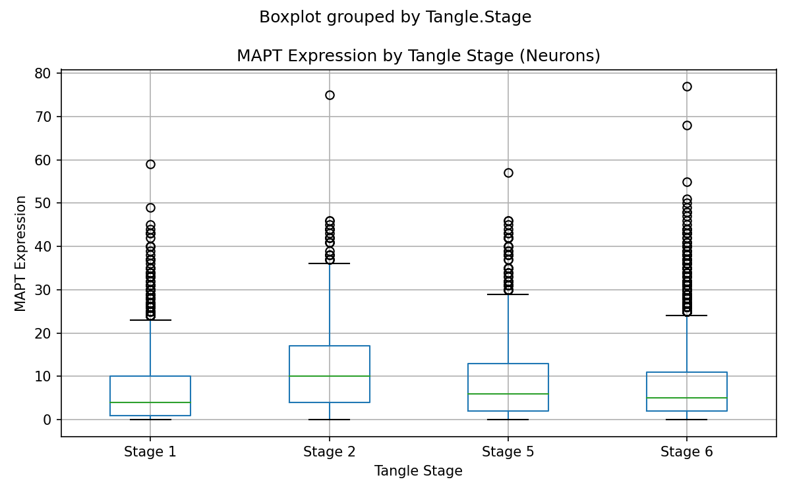
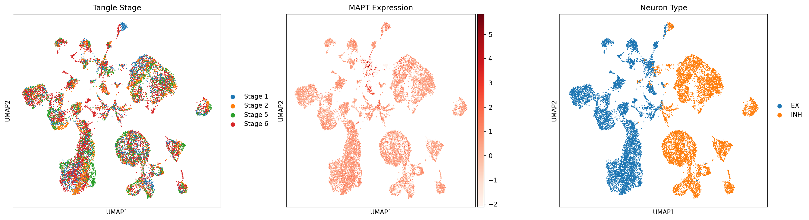
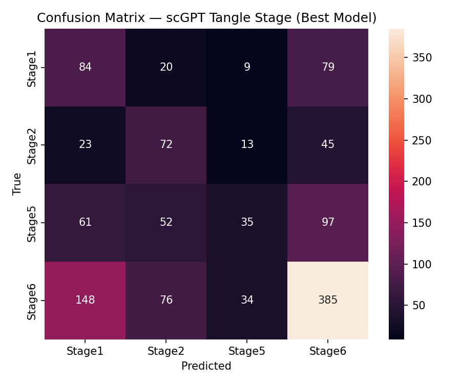
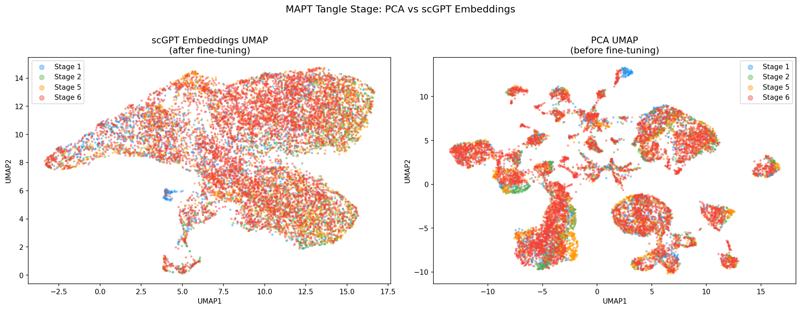

# scGPT Fine-tuning for MAPT Tangle Stage Prediction in Alzheimer's Disease

## Overview

This project fine-tunes scGPT, a transformer-based single-cell foundation model pretrained on 33 million human cells, to predict neurofibrillary tangle stage (Braak staging) from single-nucleus RNA-seq data of human Alzheimer's disease brain tissue.

Neurofibrillary tangles composed of hyperphosphorylated MAPT (tau) protein are a defining pathological feature of Alzheimer's disease. Tangle stage reflects disease severity — can a foundation model trained on gene expression alone learn to distinguish tangle stages from the transcriptional state of individual neurons?

**Key result:** 48% accuracy and weighted AUC of 0.68 on 4-class tangle stage classification from 12,331 neurons — nearly 2x random chance baseline (25%).

---

## Repository Structure
scgpt-mapt-tangle-stage/
├── scgpt_preprocessing.ipynb   # Data loading, EDA, QC, baseline UMAP
├── scgpt_finetune.ipynb        # Tokenization, fine-tuning, evaluation
├── results_summary.json        # Quantitative results
├── figures/
│   ├── MAPT_by_tangle_stage.png
│   ├── UMAP_neurons_baseline.png
│   ├── UMAP_comparison_scGPT_vs_PCA.png
│   ├── confusion_matrix_test.png
│   └── UMAP_correctness.png
├── .gitignore
└── README.md

Not included due to file size:
- Raw data files — download instructions below
- neurons_hvg_preprocessed.h5ad
- scgpt_human_model/ pretrained weights

---

## Dataset

Morabito et al. 2021 — Single-nucleus chromatin accessibility and transcriptomic characterization of Alzheimer's disease
Nature Genetics 53, 1143-1155
GEO Accession: GSE174367

- 61,472 total nuclei from human postmortem AD brain
- 12,331 neurons (EX + INH) used for this analysis
- Tangle stages: Stage 1 (n=1,918), Stage 2 (n=1,532), Stage 5 (n=2,449), Stage 6 (n=6,432)
- Note: Stages 3 and 4 are absent from this dataset

---

## Methods

### Preprocessing (scgpt_preprocessing.ipynb)
- Filtered to excitatory (EX) and inhibitory (INH) neurons — tau tangles form primarily in neurons
- Standard QC: minimum 200 genes per cell, minimum 10 cells per gene
- Normalization: total count normalization to 10,000 + log1p transformation
- Selected 3,001 highly variable genes with forced inclusion of MAPT
- 2,316 / 3,001 genes present in scGPT vocabulary

### Tokenization
- Gene expression values binned into 51 discrete bins matching pretraining format
- Top 200 expressed genes selected per cell as tokens
- Gene names mapped to vocabulary IDs from pretrained scGPT checkpoint

### Fine-tuning Strategy (scgpt_finetune.ipynb)
- Base model: scGPT whole-human pretrained on 33M normal human cells
- Unfrozen layers: last 2 transformer encoder layers + classification decoder
- Trainable parameters: 3,685,380 / 51,333,637 total (7.2%)
- Class imbalance handled via weighted random sampling + weighted CrossEntropyLoss
- Stage 6 loss weight manually tripled after initial training produced zero Stage 6 predictions
- Optimizer: AdamW, lr=1e-4, weight decay=0.01
- Early stopping with patience=3

### Train / Val / Test Split
- 80% train (9,864 cells), 10% val (1,233), 10% test (1,234)
- Stratified by tangle stage to maintain class balance

---

## Results

### Classification Performance (Test Set)

| Stage   | Precision | Recall | F1   | Support |
|---------|-----------|--------|------|---------|
| Stage 1 | 0.30      | 0.48   | 0.37 | 192     |
| Stage 2 | 0.31      | 0.41   | 0.35 | 153     |
| Stage 5 | 0.41      | 0.14   | 0.21 | 245     |
| Stage 6 | 0.64      | 0.63   | 0.63 | 644     |
| Weighted avg | 0.50 | 0.48 | 0.47 | 1234  |

Overall accuracy: 48% (vs 25% random baseline)
Weighted AUC: 0.68

### Key Figures

MAPT expression peaks at Stage 2 then declines — consistent with survivor bias

Baseline UMAP — PCA cannot separate tangle stages, motivating scGPT

Confusion matrix — Stage 6 most discriminable, Stage 5 most ambiguous

scGPT embeddings capture a continuous disease progression space

---

## Biological Findings

**Stage 6 is most discriminable (F1=0.63)**
End-stage tau pathology produces the most distinct transcriptional signature, consistent with extensive neuronal remodeling in late Alzheimer's disease.

**Stage 5 is most ambiguous (F1=0.21)**
Stage 5 may represent a transcriptional transition state with overlapping features of both severe and end-stage pathology. This is biologically interpretable rather than a model failure.

**Stage 1 / Stage 6 confusion**
The model confuses earliest and latest tangle stages. This is consistent with a survivor bias hypothesis — Stage 6 neurons that survived until death may be the most transcriptionally resilient, resembling Stage 1 neurons that have not yet mounted a stress response.

**MAPT expression peaks at Stage 2 then declines**
Counter-intuitively, MAPT expression is highest at Stage 2 (mean=11.5, 92.3% expressing) and lower at Stages 5 and 6. This likely reflects survivor bias: neurons with the highest MAPT expression are most vulnerable to tau aggregation and die earliest. By Stage 5/6, only the most resilient lower-MAPT neurons survive to be sequenced.

---

## Limitations

- Tangle stages 3 and 4 are absent from this dataset
- Analysis restricted to neurons only — excludes glial contributions to tau pathology
- Postmortem tissue — transcriptional state may reflect cell death processes
- No hyperparameter optimization performed
- Model trained on a single dataset — generalization to other cohorts untested

---

## Environment Setup

### Step 1 — Create conda environment

Run on a compute node, not the login node.

    srun --partition=gpu-interactive --gres=gpu:1 --cpus-per-task=4 --mem=32G --time=2:00:00 --pty bash
    conda create -n scgpt_mapt python=3.10 -y
    conda activate scgpt_mapt

### Step 2 — Install dependencies

    pip install "scgpt==0.2.2" "scanpy==1.9.8" "anndata==0.10.8" "torch==2.2.2" "torchtext==0.17.2" "huggingface_hub==0.23.4" "datasets==2.20.0" "matplotlib==3.7.5" "seaborn==0.13.2" "umap-learn" "ipykernel" "scikit-learn"

### Step 3 — Register Jupyter kernel

    unset PYTHONPATH
    python -m ipykernel install --user --name scgpt_mapt --display-name "scgpt_mapt"

### Step 4 — Download pretrained scGPT model

Download the whole-human checkpoint from the scGPT Model Zoo:
https://github.com/bowang-lab/scGPT#pretrained-scgpt-model-zoo

Place files in scgpt_human_model/:
    scgpt_human_model/
    ├── best_model.pt
    ├── args.json
    └── vocab.json

### Step 5 — Download dataset

    wget "https://ftp.ncbi.nlm.nih.gov/geo/series/GSE174nnn/GSE174367/suppl/GSE174367_snRNA-seq_filtered_feature_bc_matrix.h5"
    wget "https://ftp.ncbi.nlm.nih.gov/geo/series/GSE174nnn/GSE174367/suppl/GSE174367_snRNA-seq_cell_meta.csv.gz"

---

## How To Run

Set the PROJECT_DIR variable at the top of each notebook to your local project path.

Run notebooks in order:

    unset PYTHONPATH
    conda activate scgpt_mapt
    jupyter nbconvert --to notebook --execute scgpt_preprocessing.ipynb
    jupyter nbconvert --to notebook --execute scgpt_finetune.ipynb

Or open JupyterLab, select the scgpt_mapt kernel, and run interactively.

Hardware: Fine-tuning requires a GPU. Expected runtime approximately 20 minutes per epoch on a Tesla V100 32GB.

---

## References

- Cui et al. (2024) scGPT: toward building a foundation model for single-cell multi-omics using generative AI. Nature Methods
- Morabito et al. (2021) Single-nucleus chromatin accessibility and transcriptomic characterization of Alzheimer's disease. Nature Genetics

---

## Author

Durga Gomathi Arumuganainar
MS Bioinformatics, Northeastern University
github.com/durganainar22
